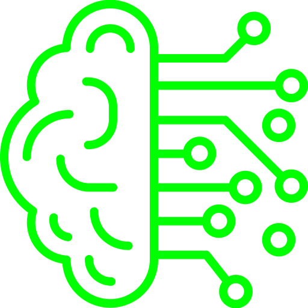

  

  <h2 align="center"><b>SMART-BRAINS</b></h2>

  

   Scan for human heads in a image.
     
    <a href="https://github.com/echosonusharma/face-detect-frontend-pern"><strong>Explore the docs »</strong></a>
     
     
    <a href="https://face-detect-frontend-pern-echosonusharma.vercel.app">View Demo</a>
    ·
    <a href="https://github.com/echosonusharma/face-detect-frontend-pern/issues">Report Bug</a>
  

 

## About The Project

FACE-DETECT does what it says, you can add a url which goes to a image and it
will scan the image for presence of any human face and will create a square around it.

### Built With

This Project is built using [Create React App](https://create-react-app.dev) and for css it uses [tachyons](https://tachyons.io), a simple took-kit for css.

### Server side

[Face-detect-backend](https://github.com/echosonusharma/face-detect-backend) hosted on heroku

### Packages

- tachyons
- react-particles-js
- react-tilt

<!-- LICENSE -->

## License

Distributed under the MIT License. See `LICENSE` for more information.

<!-- CONTACT -->

## Contact

[Sonu Sharma](https://echosonusharma.github.io/sonusharma)

Project Link: [https://github.com/echosonusharma/face-detect-frontend-pern](https://github.com/echosonusharma/anime-x)
